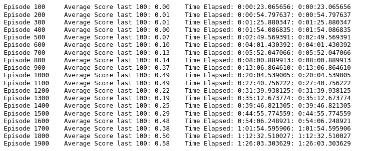
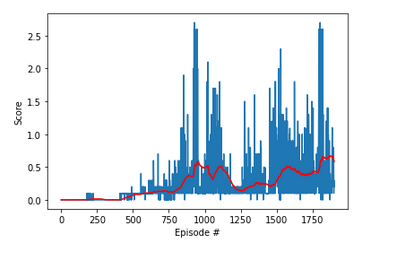

# Udacity Deep Reinforcement Learning
# Navigation 
Training multiple agents to play tennis

##### Table of Contents 
- [Project Description](#project-description)
    - [Environment](#environment)
    - [Learning algorithm](#learning-algorithm)
- [Plot of rewards](#plot-of-rewards)
- [Ideas for future Work](#ideas-for-future-work)
- [References](#references)

## Project Description
#### Environment
In this environment, two agents control rackets to bounce a ball over a net. If an agent hits the ball over the net, it receives a reward of +0.1. If an agent lets a ball hit the ground or hits the ball out of bounds, it receives a reward of -0.01. Thus, the goal of each agent is to keep the ball in play.
The observation space consists of 8 variables corresponding to the position and velocity of the ball and racket. Each agent receives its own, local observation. Two continuous actions are available, corresponding to movement toward (or away from) the net, and jumping.
The task is episodic, and in order to solve the environment, your agents must get an average score of +0.5 (over 100 consecutive episodes, after taking the maximum over both agents). 
The environment is considered solved, when the average (over 100 episodes) of those scores is at least +0.5.

#### Learning algorithm
The solution implemented is a Multi Agent Deep Deterministic Policy Gradient(MADDPG)[1]. A MADDPG is composed of multiple DDPG agents.
during step the actor choose action depending on their only observation. But the critic can use the shole state information and the actions of the other agents in order to better evaluate the optimal action value function.
This allows better estimate future rewards as the critic learns to approximate the other agents strategies. 

I have adapted the ddpg agents implemented in continuous control project of the nanodegree. I added MADDPGAgent class which has multiple agents and they share same memory buffer. Step action is implemented in MADDPGAgent class which adds to shared memory buffer and runs learning iteration for each agent.
 
 The actor network is composed of 3 FC layers with Relu activation after the first and second layer and tanh after third layer.
 - First layer: input size - 24  and output size - 256
 - Second layer: input size - 256 and output size - 128
 - Third layer: input size - 128 and output size - 2

 The critic network is composed of 3 FC layers with Leaky Relu activation after the first and second layer.
 - First layer: input size - 24  and output size - 256
 - Second layer: input size - 260 and output size - 128
 - Third layer: input size - 128 and output size - 1

training hyperparameters are as follow:
- Buffer size: 1000000
- Batch size: 512
- gamma: 0.99
- tau: 0.001
- actor learning rate: 0.0001
- critic learning rate: 0.0003
- weight decay: 0
- update every: 1
- learn n time each iteration: 1

## Plot of rewards
The environment has been solved in 1800 episodes.  

Here is the graph of the score evolution:  

## Ideas for future Work
Prioritized experience replay[3] could be implemented which speeds up convergence using more intelligent experince sampling. 
To other networks like Asynchornous Actor Critic Agent[2] and Proximal Policy Optimization [1] could be implemented.
Models like AlphaZero[4] would give even better performance.

## References
1. [PPO](https://arxiv.org/abs/1707.06347)
2. [A3C](https://arxiv.org/abs/1602.01783)
3. [Prioritized experience replay](https://arxiv.org/abs/1511.05952)
4. [AlphaZero](https://arxiv.org/abs/1712.01815)
5. [MADDPG](https://arxiv.org/abs/1706.02275)
